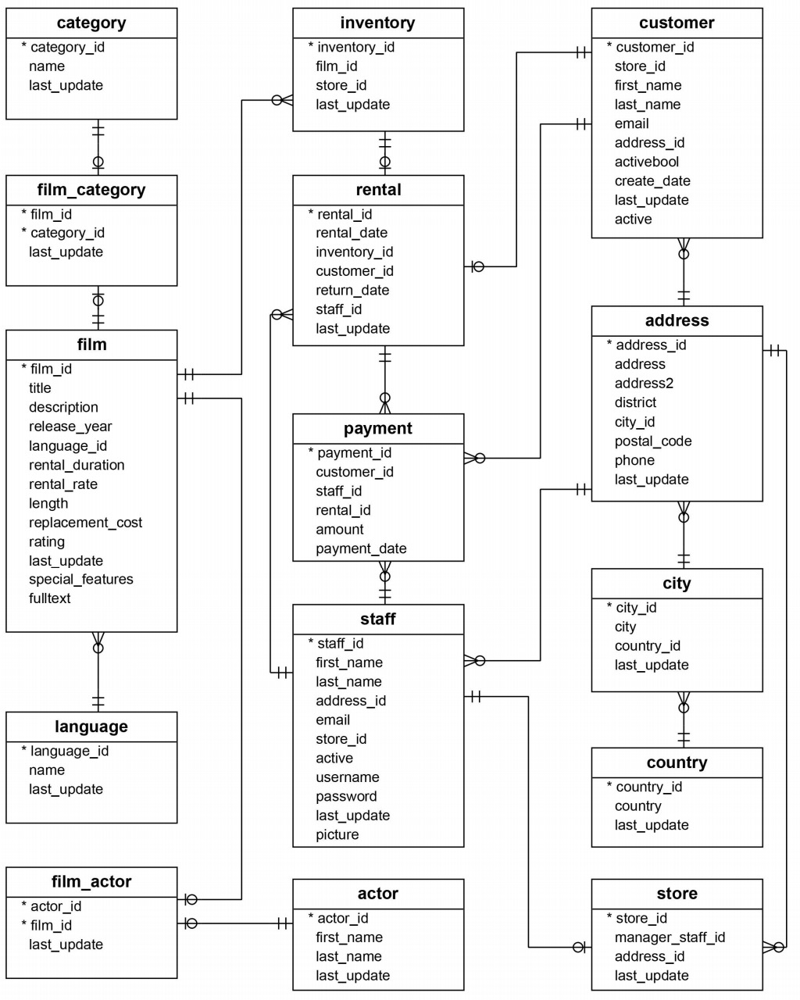
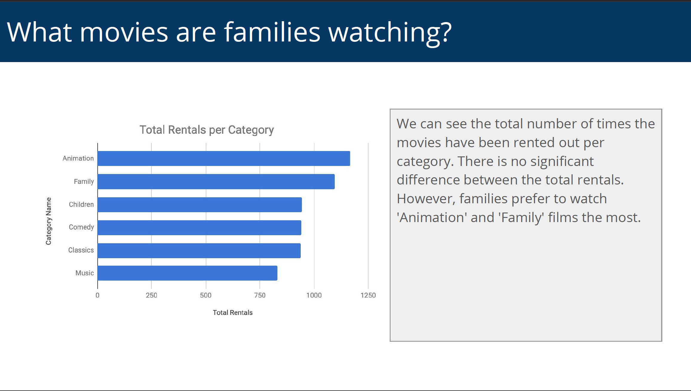
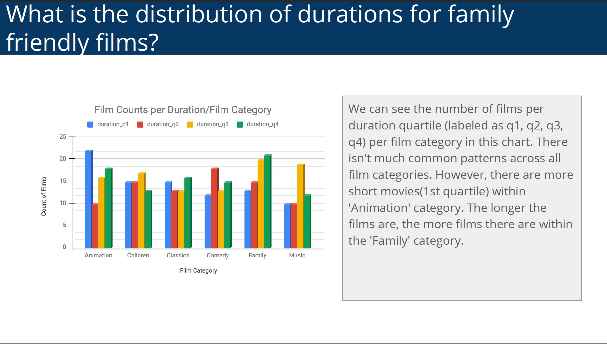
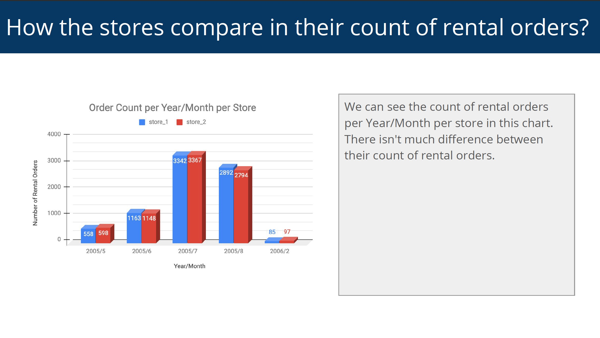
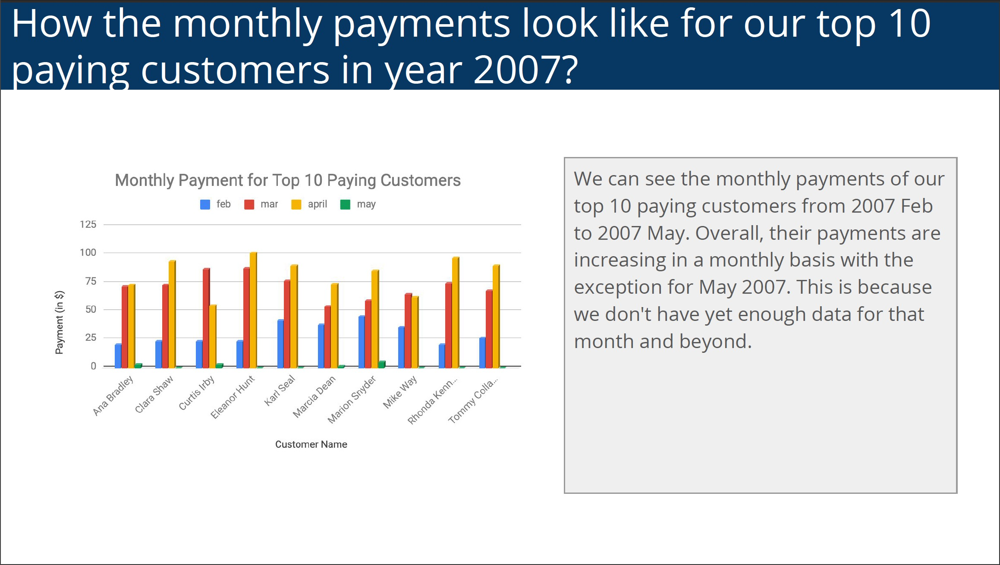

# Intro to Data Science Nanodegree Subproject
The repository contains the project information of the **Investigate a Relational Database** from Udacity Nanodegree 
**[Programming for Data Science with Python](https://www.udacity.com/course/programming-for-data-science-nanodegree--nd104)**. Please refer to the 
course [website](https://www.udacity.com/course/programming-for-data-science-nanodegree--nd104) for more details. 

## Project Goals
1. Explore and query the **[Sakila DVD Rental database](https://www.postgresqltutorial.com/postgresql-sample-database/)**
2. Answer 4 business/analytical questions by querying the database.

## Database ERD

source: [http://www.postgresqltutorial.com/postgresql-sample-database/](http://www.postgresqltutorial.com/postgresql-sample-database/)

## Questions and Query Results
Here is a list of questions and answers we want to investigate on the database. The SQL queries are provided in 
``queries.sql``.
#### Question 1

#### Question 2

#### Question 3

#### Question 4
